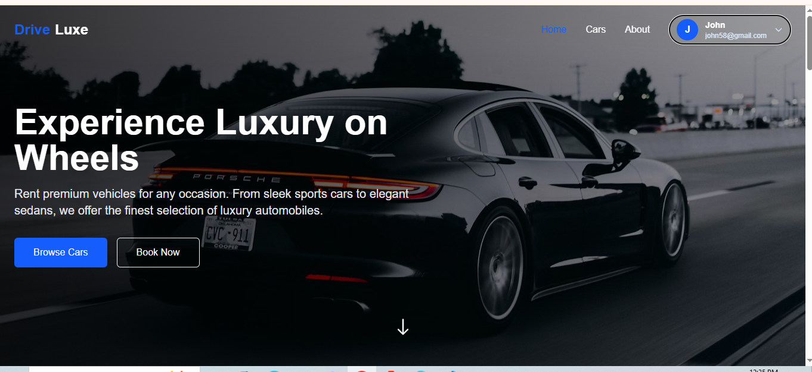
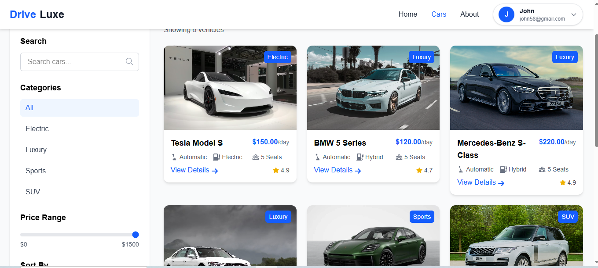
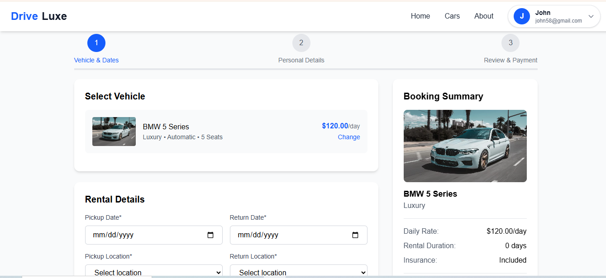
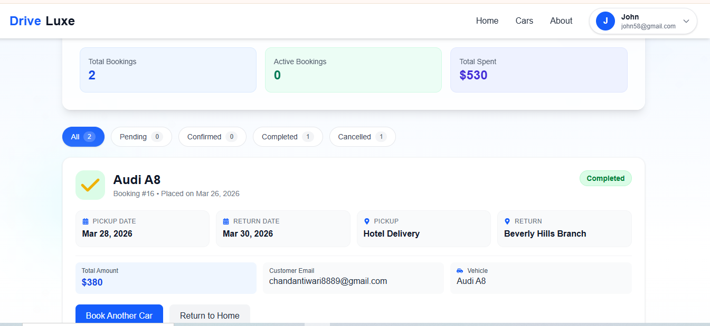

# DriveLuxe - Car Rental Platform

DriveLuxe is a full-stack car rental web application built with Django REST Framework and React.
It provides a luxury-focused booking experience with protected booking flow, booking history, and responsive UI across devices.


## Features

- User authentication with Clerk
- Browse car catalog with detailed car pages
- Protected booking flow for authenticated users
- Pre-selected booking from car cards and car detail page
- Multi-step booking form with validation
- Booking overlap prevention by date
- Booking history dashboard with status filters:
  - All
  - Pending
  - Confirmed
  - Completed
  - Cancelled
- Responsive UI for desktop and mobile

## Tech Stack

### Frontend

- React 19
- React Router
- Vite
- Tailwind CSS
- Axios
- React Icons

### Backend

- Django 5
- Django REST Framework
- Clerk (frontend auth + JWT)
- django-cors-headers
- SQLite (default)

## Project Structure

```text
CarRental/
  backend/
    manage.py
    requirements.txt
    backend/
      settings.py
      urls.py
    api/
      models.py
      serializers.py
      views.py
      urls.py
  frontend/
    package.json
    src/
      App.jsx
      config/api.js
      pages/
      components/
  assets/
    screenshots/
```

## Prerequisites

- Python 3.11+ (or compatible with Django 5)
- Node.js 18+
- npm

## Environment Variables

Create a `.env` file inside `backend/`:

```env
DJANGO_SECRET_KEY=replace-with-a-secure-secret-key
DJANGO_DEBUG=True
DJANGO_ALLOWED_HOSTS=127.0.0.1,localhost
DJANGO_CORS_ALLOWED_ORIGINS=http://127.0.0.1:5173,http://localhost:5173
CLERK_ISSUER=https://your-clerk-domain.clerk.accounts.dev
CLERK_JWKS_URL=https://your-clerk-domain.clerk.accounts.dev/.well-known/jwks.json
CLERK_AUDIENCE=
```
frontend environment file (`frontend/.env`):

```env
VITE_API_BASE_URL=http://localhost:8000/api
VITE_CLERK_PUBLISHABLE_KEY=pk_test_xxxxxxxxxxxxxxxxx
```

## Local Setup

### 1) Clone repository

```bash
git clone <your-repo-url>
cd CarRental
```

### 2) Backend setup

```bash
cd backend
python -m venv venv
# Windows
venv\Scripts\activate
# macOS/Linux
source venv/bin/activate

pip install -r requirements.txt
python manage.py migrate
python manage.py runserver
```

Backend runs on:

- http://127.0.0.1:8000

### 3) Frontend setup

Open a new terminal:

```bash
cd frontend
npm install
npm run dev
```

Frontend runs on:

- http://127.0.0.1:5173

## Available Frontend Scripts

```bash
npm run dev
npm run build
npm run preview
npm run lint
```

## API Endpoints

Base URL:

- `/api/`


## Authentication Flow

- User signs in/up with Clerk UI (`/login`, `/register`)
- Frontend gets Clerk session JWT and sends it in Authorization header:
  - `Authorization: Bearer <jwt>`
- Backend verifies JWT against Clerk JWKS and maps Clerk user to a Django user
- Protected routes:
  - `/booking`
  - `/booking/:id`
  - `/mybookings`


## Screenshots

Add your screenshots in the folder below:

- `assets/screenshots/homepage.png`
- `assets/screenshots/cars-page.png`
- `assets/screenshots/booking-page.png`
- `assets/screenshots/mybookings-page.png`


### Home Page


### Cars Page


### Booking Page


### Booking History (My Bookings)

